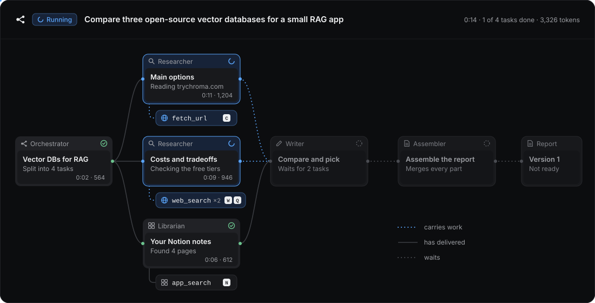
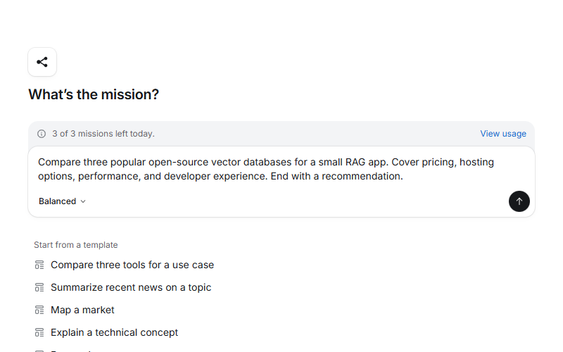
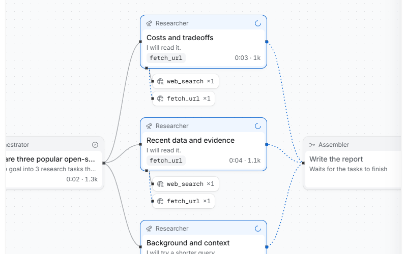
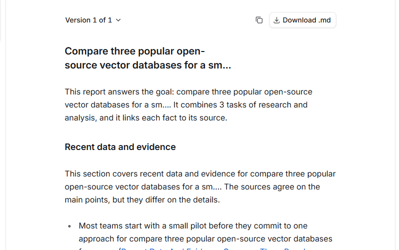
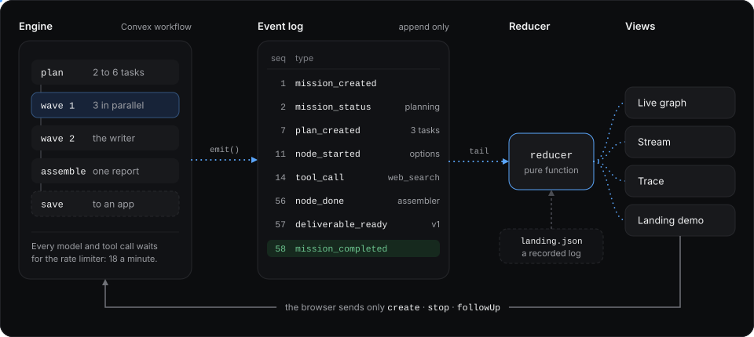
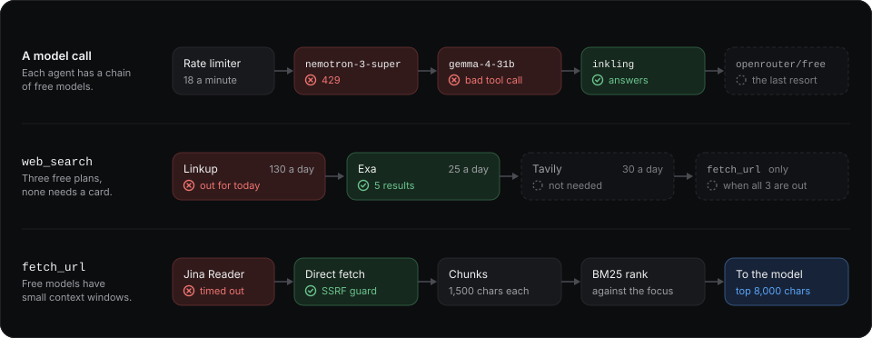

# Mission Control

<p align="center">
  
</p>

Type a research goal. An orchestrator splits it into tasks, a small team of AI agents works on them in parallel, and you watch every step on a live graph. At the end you get a markdown report with every source linked.

I built it because deep research in Claude and ChatGPT is good but slow, and while it runs you get a status line and a timer. Here the work is the interface. Click any task and you can read what the agent thought, which pages it searched and read, and how many tokens it spent. If one part comes back wrong, you fix that part from the chat and keep the rest. It all runs on free models.

## What a mission looks like

<table>
  <tr>
    <td width="33%">
      <picture>
        <source media="(prefers-color-scheme: dark)" srcset="public/landing/step-1-dark.png">
        
      </picture>
    </td>
    <td width="33%">
      <picture>
        <source media="(prefers-color-scheme: dark)" srcset="public/landing/step-2-dark.png">
        
      </picture>
    </td>
    <td width="33%">
      <picture>
        <source media="(prefers-color-scheme: dark)" srcset="public/landing/step-3-dark.png">
        
      </picture>
    </td>
  </tr>
  <tr>
    <td>Write a goal, or start from a template.</td>
    <td>Watch the agents work on the graph.</td>
    <td>Read, download, or save the report.</td>
  </tr>
</table>

1. You write a goal. Each user gets 3 missions a day.
2. The orchestrator makes a plan of 2 to 6 tasks and the order they run in. If the plan is not a valid graph, it tries again. You never see a broken plan.
3. Tasks run in waves: every task whose inputs are ready runs at the same time. Researchers search and read the web. The Librarian searches the apps you connected.
4. A writer can turn the research into a comparison, a table, or a recommendation.
5. The assembler merges the parts into one report and lists each source once.
6. You keep talking to the orchestrator in the chat. It answers questions, reruns a task, adds a task, rewrites or edits the report, and saves it to an app. Each report change is a new version, and the old versions stay.

The mission runs on the server, so closing the tab does not stop it. Open it again and the graph shows where it got to.

The graph has one visual rule: edges show state. A dotted gray edge waits. A dotted blue edge that moves carries work. A solid edge has delivered.

## The agents

| Agent | What it does | Tools |
|---|---|---|
| Orchestrator | Splits the goal into tasks and sets their order. After the report, it handles the follow-ups in the chat. | none |
| Researcher | Searches the web, reads the best pages, and writes up what it found. | `web_search`, `fetch_url`, `write_section` |
| Librarian | Searches your connected apps. For an app with Write on, it can also create new items there. | `app_search`, `app_write`, `write_section` |
| Writer | Combines the research into one part: a comparison, a table, or a recommendation. | `write_section` |
| Assembler | Merges the parts into one report and lists every source. | none |

The Librarian joins a mission only when the goal needs your own data or asks to save something. It works with the 17 apps on the Integrations page, through [Composio](https://composio.dev). Read is on by default for each app you connect. Write is off until you turn it on, and even then the Librarian only creates new items, 2 per task at most: a Notion page, a Google Doc, a Gmail draft (never sent), a Slack message, or a GitHub issue. It never edits or deletes anything.

## How it works

<p align="center">
  
</p>

Everything on screen comes from one table of events.

- The engine is a Convex workflow: plan, then waves of tasks, then the assembler, then the save step. Each step writes what happened as events, such as `plan_created`, `tool_call`, `tool_result`, and `node_done`. Nothing changes or deletes an event, and the `seq` numbers have no gaps, even when tasks run in parallel.
- The browser subscribes to the log with a reactive query. One pure reducer turns the events into the graph, the stream, and the trace. The browser writes nothing but intents: create, stop, and follow-up.
- The landing page plays a recorded event log through the same reducer, with no backend.
- Every model call and tool call waits for a shared rate limiter. A mission has a budget of 60 model calls, and each follow-up adds 40.
- Big texts (prompts, pages, outputs) live in an artifacts table. Events carry previews of 500 characters or less, so the log stays small and live updates stay light.
- Every 5 minutes, a cron job fails any mission with no activity for 10 minutes. No mission stays "running" forever.

## Built for free models

<p align="center">
  
</p>

Mission Control uses only free OpenRouter models. The account allows 20 requests a minute and 1,000 a day, shared by every user, which comes to about 25 to 40 missions a day. Free models also come and go, and their tool calls are not always valid. So each step has a fallback:

- Each agent has a chain of models. After a provider error, a tool call that one repair can't fix, or output that fails the schema, the next model in the chain takes the call. A daily cron refreshes the catalog of free models, and the chain skips models that are gone.
- `web_search` tries Linkup, then Exa, then Tavily. All three have free plans that need no card. A service that is out of searches, returns an error, or takes longer than 9 seconds passes the query to the next one.
- `fetch_url` reads a page through Jina Reader, or fetches it directly behind an SSRF guard when Jina fails. It cuts the page into chunks of 1,500 characters, ranks them with BM25, and sends the model the best 8,000 characters. BM25 needs no model calls, which matters on 1,000 calls a day.
- When fewer than 45 calls are left for the day, the app refuses new missions. Missions that already run can finish.

## Stack

| Part | Choice |
|---|---|
| Web | Next.js (App Router, `proxy.ts`), React, TypeScript, shadcn/ui on Base UI, Tailwind, Motion |
| Graph | React Flow with a dagre layout |
| Backend | Convex: database, reactive queries, and the Workflow and Rate Limiter components |
| Auth | Better Auth on Convex: email and password, GitHub, Google |
| Models | Free OpenRouter models through the Vercel AI SDK |
| Tools | Linkup, Exa, and Tavily for search, Jina Reader for pages, Composio for apps |

There is no LangChain. The AI SDK already does multi-step tool calls and structured output, and a second layer would make it harder to write an event before and after every call.

## Run it

1. Install the packages: `npm install`.
2. Start Convex in its own terminal: `npx convex dev`. The first run creates a deployment and writes `.env.local`.
3. Set the Convex environment (see below): `npx convex env set NAME value`.
4. Add `NEXT_PUBLIC_SITE_URL=http://localhost:3000` to `.env.local`.
5. Start the web app: `npm run dev`, then open http://localhost:3000.

Without an OpenRouter key, missions run in simulated mode: scripted agents with realistic delays, and no model or search calls. It is the quickest way to try the app. Set the keys to run live missions.

To deploy to Vercel and Convex Cloud, follow [`docs/deploy.md`](docs/deploy.md).

## Environment

Convex (`npx convex env set`):

| Name | Needed | Purpose |
|---|---|---|
| `BETTER_AUTH_SECRET` | Yes | Session signing. Use 32 random bytes in base64. |
| `SITE_URL` | Yes | The web app URL, for example `http://localhost:3000`. |
| `GITHUB_CLIENT_ID`, `GITHUB_CLIENT_SECRET` | No | GitHub sign-in. Callback: `{SITE_URL}/api/auth/callback/github`. |
| `GOOGLE_CLIENT_ID`, `GOOGLE_CLIENT_SECRET` | No | Google sign-in. Callback: `{SITE_URL}/api/auth/callback/google`. |
| `OPENROUTER_API_KEY` | Live mode | Model calls. |
| `OPENROUTER_DAILY_CAP` | No | Daily request cap of the account. Default 1000. |
| `OPENROUTER_MODELS` | No | Model chain for every agent, comma-separated. Example: `openrouter/free`. Replaces the presets in `src/shared/models.ts`. |
| `OPENROUTER_MODELS_ORCHESTRATOR`, `_RESEARCHER`, `_WRITER`, `_LIBRARIAN`, `_ASSEMBLER` | No | Model chain for one agent. Wins over `OPENROUTER_MODELS`. |
| `LINKUP_API_KEY` | Live mode, one search key or more | `web_search`, tried first. Free plan: about 4,000 searches each month. Sign up with a work email. |
| `EXA_API_KEY` | Live mode, one search key or more | `web_search`, tried second. Free plan: $10 of searches each month. |
| `TAVILY_API_KEY` | Live mode, one search key or more | `web_search`, tried last. Free plan: 1,000 searches each month. Without any search key, agents use `fetch_url` only. |
| `LINKUP_DAILY_CAP`, `EXA_DAILY_CAP`, `TAVILY_DAILY_CAP` | No | Searches each day for all users, per service. Defaults 130, 25, and 30 (the free plans). |
| `JINA_API_KEY` | No | Higher Jina Reader limits. |
| `LLM_MODE` | No | `simulated` or `live`. Default: live when an OpenRouter key is set. |
| `MISSION_QUOTA` | No | Missions for each user each day. Default 3. `off` removes the limit (development). |
| `COMPOSIO_API_KEY` | No | Connect third-party apps on the Integrations page through [Composio](https://composio.dev). The Librarian searches apps with Read on, and creates items in apps with Write on. |

A sign-in button shows only when its provider has keys.

Next.js (`.env.local`): `NEXT_PUBLIC_CONVEX_URL`, `NEXT_PUBLIC_CONVEX_SITE_URL`, `NEXT_PUBLIC_SITE_URL`.

## Scripts

| Command | Does |
|---|---|
| `npm run dev` | Web app in development. |
| `npx convex dev` | Convex functions, with codegen on each save. |
| `npm test` | Backend tests (convex-test): auth scope, seq order, quotas, lists, tool guards. |
| `npm run build` | Production build. |
| `npm run lint` | ESLint. |

## Where things are

```
convex/              schema, missions, events, quotas, auth, integrations
convex/engine/       the mission engine: workflow, plan, worker, assembler, save, tools
src/shared/          code for both sides: events, reducer, plan rules, model chains, constants
src/features/        the UI, one folder per feature: mission-graph, mission-stream, trace, composer, ...
fixtures/missions/   recorded event logs for the landing demo
docs/                product spec, tech spec, deploy guide
```

Every tunable number (limits, timeouts, budgets) is in [`src/shared/constants.ts`](src/shared/constants.ts).

## Notes

- Model chains are in [`src/shared/models.ts`](src/shared/models.ts). `BLOCKED_MODELS` lists models that are never used, not even from env. A daily cron refreshes the free model catalog and skips preset models that are gone. A chain set by env is used as given. The Agents page shows the chains in use.
- The landing demo plays [`fixtures/missions/landing.json`](fixtures/missions/landing.json), an event log recorded from a mission. To record a new one, run a mission, export its events with `events:page`, and replace the file.

## Docs

- [`docs/prd.md`](docs/prd.md): what v1 and v2 do, and the limits they work in.
- [`docs/tech-spec.md`](docs/tech-spec.md): the engine, events, limits, and every decision with its reason.
- [`docs/deploy.md`](docs/deploy.md): Vercel and Convex Cloud.

The design doc (`docs/design.md`: tokens, components, and the run view) is kept private and is not in this repo.

## What's next

v2 is specced in the PRD but not built. It adds a critic that reviews each task, approval gates, guidance for a mission while it runs, replay, public share links, custom agents with memory, scheduled missions, and PDF export.

## License

MIT. See [`LICENSE`](LICENSE).

Made by [eagledev.in](https://eagledev.in).
